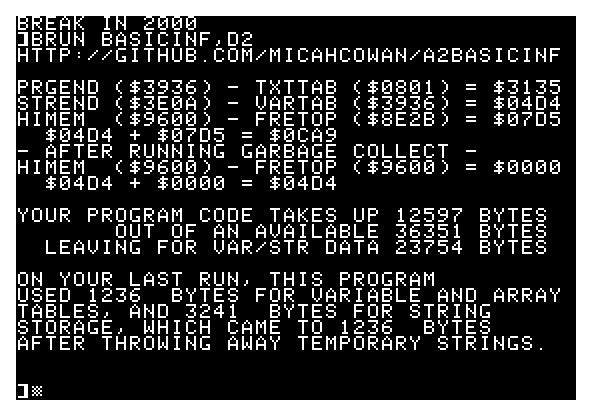

a2basicinf
=====

[Open (and edit!) this project in 8bitworkshop](http://8bitworkshop.com/dev/?platform=apple2&githubURL=https%3A%2F%2Fgithub.com%2Fmicahcowan%2Fa2basicinf&file=basicinf.s).

Simple utility to print out useful information about how much space your AppleSoft program is using.
Gets loaded in `$6000`, which may or may not be important space for your AppleSoft program, so be sure to save it before running BASICINF!

## Notes on building

To build via the Makefile, you'll need cc65 installed, and also **deater**'s [dos33fsprogs](https://github.com/deater/dos33fsprogs). Note that **deater**'s repo contains many, many more things than you need for building this project - only the bits in `utils/dos33fs-utils` and `utils/asoft_basic-utils` are needed. You can go into those dirs and build them individually (and then place them somewhere on your path, so my Makefile will find them!).

## Other dev notes

**What are all these other files that aren't even used by the Makefile?**, you may well ask. Good question!

I developed this utility (and most Apple II software I've made) using http://8bitworkshop.com/, which by default uses a [fake-but-free Apple II ROM](http://a2go.applearchives.com/roms/) from the Apple II Go emulator project, and also is hardcoded to assume your program code starts at `$803`.

For this reason, I (a) include a correct apple2 ROM in my project, so that I have access to AppleSoft BASIC, and (b) have additional starter code in `basicinf-startup.s`, `basicinf-basic.s`, and `load-and-run-basic.s`, along with `basicinf.cfg`, the linker script for use in 8bws (as opposed to `build.cfg`, the linker script used in the `Makefile`).

This project includes code from other projects I've done:
 * https://github.com/micahcowan/math-ca65 (from which I just copied-and-pasted a couple routines to print unsigned words as decimal numbers), and
 * https://github.com/micahcowan/8bit-a2-run-basic-prog, which allows projects on 8bitworkshop to bootstrap themselves into a BASIC program, without a DOS.
